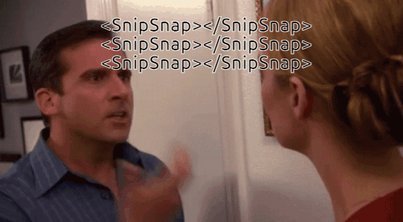
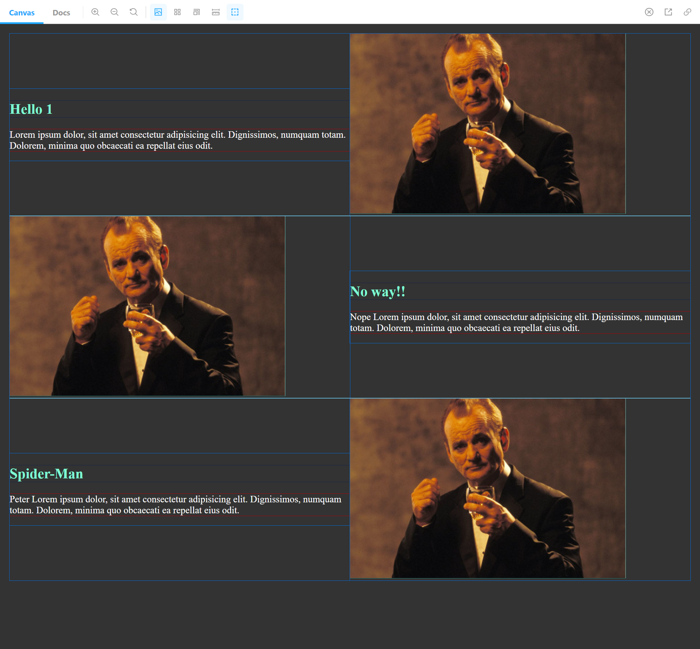
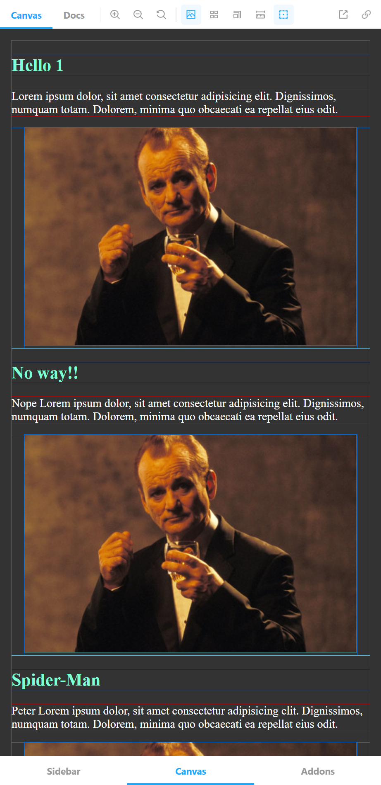

# SnipSnap



SnipSnap is a responsive React component that helps you create a zig-zag/switcharoo content layout without hassle. It uses `styled-components` for styling. (The only styling is flex related, there's no visual styling.) So you are required to install styled-components.

- [SnipSnap](#snipsnap)
  - [How to install](#how-to-install)
  - [How to use](#how-to-use)
    - [Example Usage](#example-usage)
    - [Example Screenshots](#example-screenshots)
      - [Desktop](#desktop)
      - [Responsive (`breakpoint` prop is set `600px`)](#responsive-breakpoint-prop-is-set-600px)
    - [Props](#props)
      - [Required Props and Types](#required-props-and-types)
        - [Types](#types)
        - [Defaults](#defaults)

## How to install

```
npm install snipsnap
```

## How to use

### Example Usage

```jsx
import SnipSnap from "snipsnap";
```

```jsx
{
  content.map((item, index) => (
    <SnipSnap breakpoint="400px" reverseOrder={false} id={index}>
      <div>
        <h1 style={{ color: "aquamarine" }}>{item.title}</h1>
        <p style={{ color: "white" }}>{item.post}</p>
      </div>
      <div>
        
      </div>
    </SnipSnap>
  ));
}
```

### Example Screenshots

Keep in mind that colors are only there to show you how this works. SnipSnap only styles the layout. And does a pretty minimal job at it. All the margins you see are browser defaults.

#### Desktop



#### Responsive (`breakpoint` prop is set `600px`)



### Props

SnipSnap takes 3 props.

**`breakpoint`**: Is a string. It helps you define the responsiveness. i.e `630px` This prop is `0px` by default.

```css
  @media (max-width: ${({breakpoint}) => breakpoint}) {
    flex-direction: column;
  }
```

**`id`**: SnipSnap is designed to used with `map()` method. This prop helps SnipSnap to reverse the order of content. Packages like `uuid` would not work since the component only works with numbers and checks if they are odd or even. So, the ideal usage of SnipSnap is as follows.

```jsx
{
  content.map((item, index) => (
    <SnipSnap breakpoint="400px" reverseOrder={false} id={index}>
      <div>
        <h1>{item.title}</h1>
        <p>{item.post}</p>
      </div>
      <div>
        
      </div>
    </SnipSnap>
  ));
}
```

**`reverseOrder`**: This is `false` by default. If you are happy with the order of your layout, you shouldn't change this. If you change it to `true`, it reverses the content order inside the individual SnipSnaps.

```jsx
const Root = styled.section`
  display: flex;
  align-items: center;
  flex-direction: ${({ layout }) => layout || "row"};

  & > div {
    flex: 1;
  }

  @media (max-width: ${({ breakpoint }) => breakpoint}) {
    flex-direction: column;
  }
`;
```

#### Required Props and Types

##### Types

```jsx
SnipSnap.propTypes = {
  breakpoint: PropTypes.string,
  reverseOrder: PropTypes.bool,
  id: PropTypes.number.isRequired,
  children: PropTypes.element.isRequired,
};
```

##### Defaults

Default values of the props are as following.

```jsx
SnipSnap.defaultProps = {
  breakpoint: "0px",
  reverseOrder: false,
};
```
